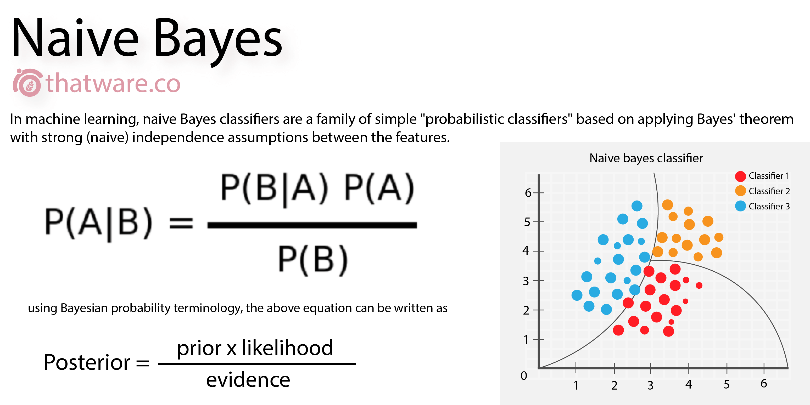

## Is It An Action Film or A Comedy?

This notebook demonstrates how to train a simple naive bayes classfier to recognize the genre of the film through its reivew. 

Before we start, below is a picture demonstration of the equation for calculating the likelihood.

1. Prior: number of files in given class, i.e. if 2 out of 5 reviews are action films, 0.4 will be its prior prob.
2. Likelihood or P(feature|class): give num of features, what's the likelihood that its an action film (words|action)
3. Evidence: number of data points (here namely reviews) we have. 

Note that in this exercise about computing the denominator for the naive Bayes classifier, we can ignore the denominator since we're comparing P(action | review) and P(comedy | review) and so can cancel out their denominators to simplify our work.

```python
from IPython.core.display import Image
Image('https://javafreecode.files.wordpress.com/2015/02/posterior-full.png')
```



## Building and Storing Feature Vectors

Create parameters to store the **features** into an appropriate data structure of your choice. 

Here `numpy` is used to create matrices for creating **feature vectors**
In the past, I have primarily used `dictionaries` for storing data. Alternatively, `numpy` supports various magic operations on the data structure and is very powerful. Therefore, here `numpy` is used.

Please click for more information about how to use [numpy](https://cs231n.github.io/python-numpy-tutorial/).

```python
import os
import numpy as np
from collections import defaultdict
import nltk
#nltk.download('punkt')

prior = np.zeros(2)       #self.prior
N_doc = 0 #number of documents
N_class = np.zeros(2) #
doc_action = []
doc_comedy = []
doc_all = []
```

```python

```

## Edit your post metadata

The first cell of your Jupter notebook will contain your post metadata ([front matter](https://sourcethemes.com/academic/docs/front-matter/)).

In Jupter, choose *Markdown* as the type of the first cell and wrap your Academic metadata in three dashes, indicating that it is YAML front matter: 

```
---
title: My post's title
date: 2019-09-01

# Put any other Academic metadata here...
---
```

Edit the metadata of your post, using the [documentation](https://sourcethemes.com/academic/docs/managing-content) as a guide to the available options.

To set a [featured image](https://sourcethemes.com/academic/docs/managing-content/#featured-image), place an image named `featured` into your post's folder.

For other tips, such as using math, see the guide on [writing content with Academic](https://sourcethemes.com/academic/docs/writing-markdown-latex/). 

## Convert notebook to Markdown

```bash
jupyter nbconvert index.ipynb --to markdown --NbConvertApp.output_files_dir=.
```

## Example

This post was created with Jupyter. The orginal files can be found at https://github.com/gcushen/hugo-academic/tree/master/exampleSite/content/post/jupyter