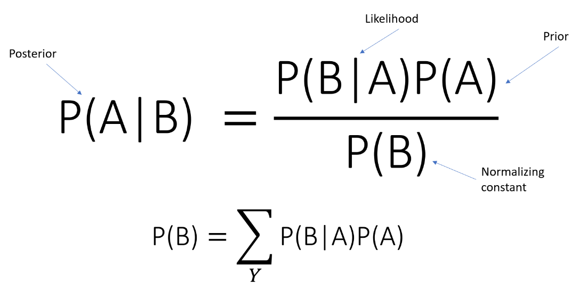

```python
from IPython.core.display import Image
Image("/Users/shiyishen/GitHub/shiyishen3447/content/post/simple-naive-bayes/featured.png")
```

 

## Import All The Necessary Libs 
Here we will import `numpy` and build matrices and arrays to support our data structure 

In the past, I have primarily used dictionary for data storage. Alternatively, `numpy` can do powerful magic tricks to 
the arrays and matrices. Therefore, in this project I use `numpy` to store all the `feature vectors`.


```python
import os 
import numpy as np
from collections import defaultdict
import nltk 
#nltk.download(punkt)
```
